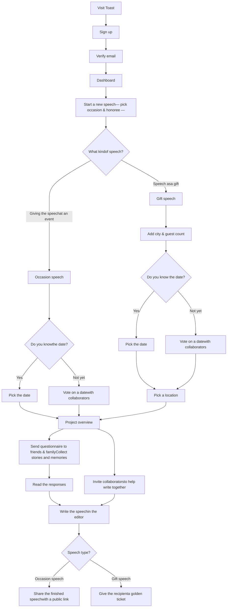

# User Flow — Toast

## The happy path

### Occasion speech — giving a speech at an event
1. **Sign up** and verify your email
2. **Start a speech** — pick the occasion, the honoree, and whether you know the date yet
3. **Set the date** — pick it directly, or use the date voting tool with collaborators
4. **Gather material** — send a questionnaire link to friends and family (no account needed)
5. **Read the responses** — see everything that came in, in one place
6. **Write together** — invite collaborators to help edit the speech in the shared editor
7. **Share it** — when ready, share the speech via a public read-only link

### Gift speech — speech as a present
1. **Sign up** and verify your email
2. **Start a speech** — pick the occasion, the honoree, city, and expected guest count
3. **Set the date** — pick it directly, or vote on one with collaborators
4. **Pick a location** — add a venue for the occasion
5. **Gather material** — send a questionnaire to friends and family
6. **Read the responses** and **write together** with collaborators
7. **Give a golden ticket** — hand the recipient a surprise ticket revealing the speech
